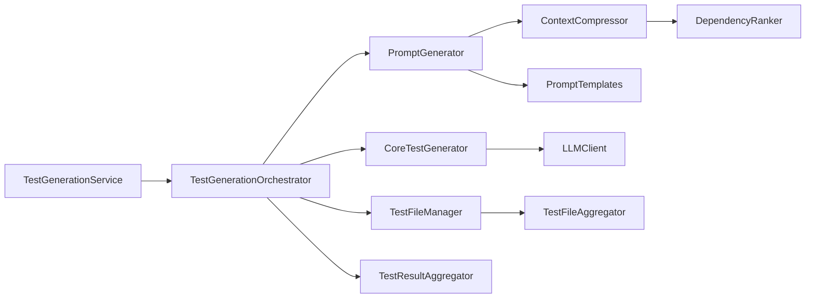
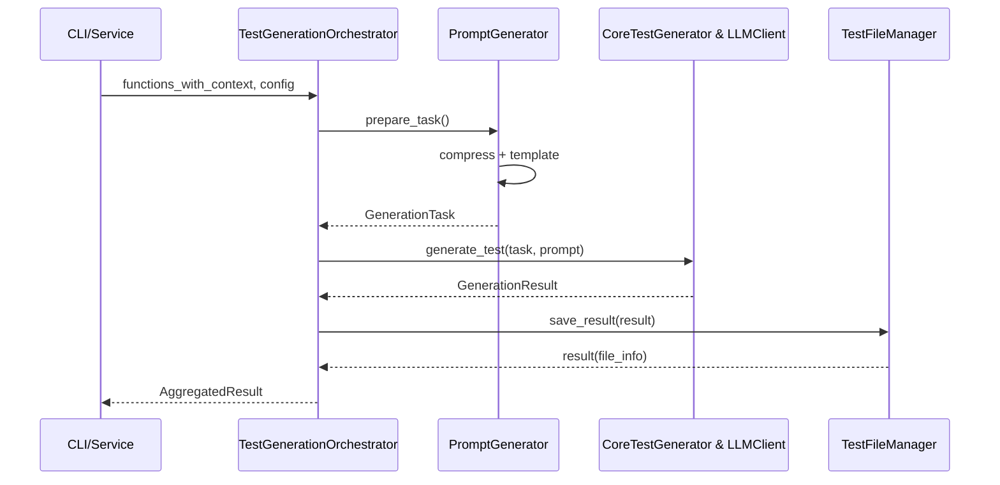
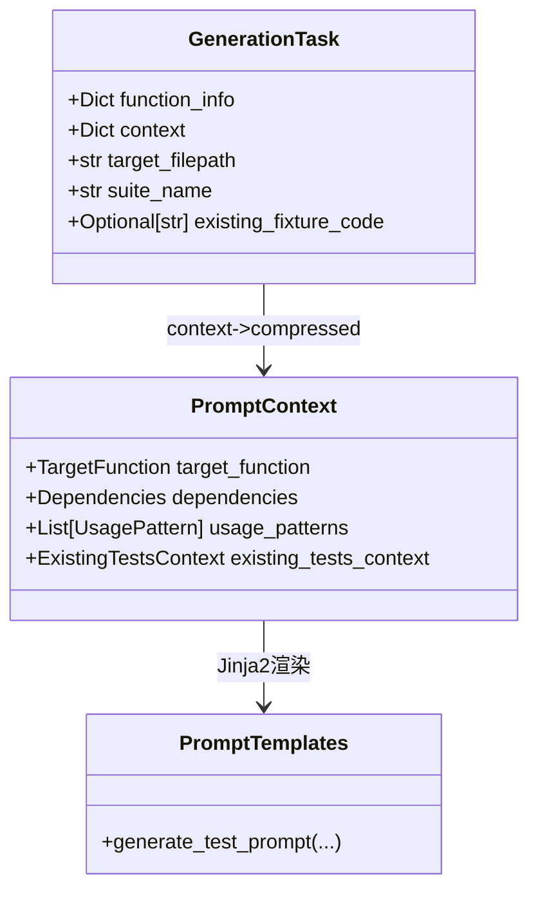
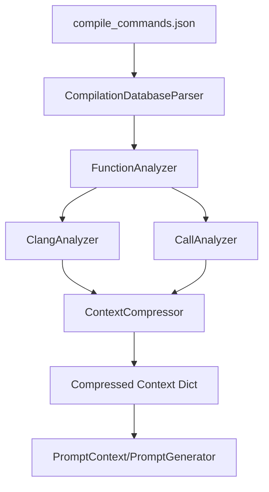

**架构总览**
- 平台围绕 `TestGenerationService` 聚合三大子系统：源码分析、上下文建模与压缩、测试生成执行。核心模块分布于 `src/analyzer`, `src/utils`, `src/test_generation`。
- 服务入口 `src/test_generation/service.py:38` 暴露旧接口并调度 `TestGenerationOrchestrator`，后者协调任务准备、LLM 调用、结果落盘等阶段，参见 `src/test_generation/orchestrator.py:42`。
- 数据结构集中在 `src/test_generation/models.py:12`，负责把函数信息、压缩上下文与生成结果组织成可序列化的结构体，支撑“结构体拼接”主线。
- 日志与配置通过 `src/utils/logging_utils.py`、`src/utils/config_manager.py` 注入，保证 CLI (`src/main.py:61`) 与 MCP 服务一致的依赖注入体验。

---

**单元测试生成主线**
- 入口：`TestGenerationService.generate_tests` (`src/test_generation/service.py:38`) 将项目配置转成 `TestGenerationConfig`，并实例化 `TestGenerationOrchestrator`。
- 任务准备：`_prepare_tasks` (`src/test_generation/orchestrator.py:114`) 对每个函数上下文构建 `GenerationTask`，自动匹配目标测试文件及夹具 (`PromptGenerator.prepare_task` at `src/test_generation/components.py:49`)。
- 提示词构造：`PromptGenerator.generate_prompt` (`src/test_generation/components.py:29`) 调用上下文压缩与 Jinja2 模板生成面向 LLM 的提示。
- LLM 调用：`CoreTestGenerator.generate_test` (`src/test_generation/components.py:79`) 通过 `LLMClient.generate_test` (`src/llm/client.py:49`) 执行带重试的生成。
- 结果写入：`TestFileManager.save_result` (`src/test_generation/components.py:143`) 调用 `TestFileAggregator.aggregate` (`src/utils/test_aggregator.py:31`) 叠加测试代码，并将 prompt/raw/test 三类制品分别落盘。

- 可靠性保障：执行策略来自 `ExecutionStrategyFactory`，默认并发 (`src/test_generation/strategies.py:64`)，支持顺序/自适应，方便根据 LLM 配额调整。

---

**结构体拼接主线（上下文模型与提示模板装配）**
- 核心数据结构定义在 `src/test_generation/models.py:12`。`GenerationTask`/`GenerationResult` 表达单次任务生命周期，`PromptContext`/`Dependencies`/`ExistingTestsContext` 则封装被测函数、依赖、既有测试等语义信息。
- `PromptGenerator.prepare_task` (`src/test_generation/components.py:49`) 将函数分析产物拼装成 `GenerationTask`，并注入 fixture 文本与现有测试上下文，实现“结构体拼接”前半段。
- `PromptTemplates.generate_test_prompt` (`src/utils/prompt_templates.py:25`) 支持两种调用：直接使用 `PromptContext` 或从压缩字典即时构造；最终通过模板加载器 `PromptTemplateLoader` (`src/utils/prompt_template_loader.py:32`) 渲染语言定制片段（含 mock 指南段落）。
- 模型转换：`PromptContext.from_compressed_context` (`src/test_generation/models.py:272`) 负责把压缩后的原始 dict 转成强类型结构，并在 `to_dict` (`src/test_generation/models.py:317`) 保持回写能力，保证上下游兼容。
- 生成结果序列化：`GenerationResult.to_dict` (`src/test_generation/models.py:34`) 保留 usage/model 信息，方便 CLI 与历史 API 读取。

---

**上下文感知主线（分析与压缩）**
- 项目分析：`TestGenerationService.analyze_project_functions` (`src/test_generation/service.py:109`) 解析 `compile_commands.json`（`src/parser/compilation_db.py:12`），遍历编译单元并调用 `FunctionAnalyzer.analyze_file` (`src/analyzer/function_analyzer.py:17`) 抽取测试候选。
- 依赖提取：`ClangAnalyzer` (`src/analyzer/clang_analyzer.py:15`) 使用 libclang AST 抽取被调函数、宏、结构体定义，同时构建 `function_definition_map` 以便后续引用函数体。
- 调用上下文：`CallAnalyzer.find_call_sites` (`src/analyzer/call_analyzer.py:15`) 扫描工程调用点并生成上下文窗口，补充非静态分析信息。
- 上下文压缩：`ContextCompressor.compress_function_context` (`src/utils/context_compressor.py:41`) 结合 `DependencyRanker` (`src/utils/dependency_ranker.py:40`) 的重要度打分，按压缩级别裁剪函数依赖、宏与使用示例，确保 token 限额 (`src/utils/token_counter.py:12`)。
- 演进策略：当 token 超限时 `_ensure_optimal_size` (`src/utils/context_compressor.py:231`) 分三阶调整，包括截断调用上下文、减少依赖详情、清空使用样本，保证 LLM 输入稳定。

- 上下文与已有测试融合：若配置测试目录，`TestFileMatcher.get_test_context_for_function` (`src/utils/test_file_matcher.py:106`) 会补充已有测试/fixture，最终由压缩流程一起进入 Prompt 模板，实现上下文感知的闭环。

---

**附加说明**
- CLI 与脚本可通过 `python -m src.main --list-projects` 查看配置，或使用 `--simple` 快速生成；应先运行 `python scripts/check_env.py` 确认 libclang 等依赖。
- 进一步验证可调用 `pytest tests/unit -q` 聚焦核心工具；建议增补围绕 `ContextCompressor` 与 `TestFileAggregator` 的单测保障重构时的稳定性。

如需后续支持，可考虑：
1. 扩展上下文压缩策略的可配置性（如按语言差异调整宏/结构体上限）。
2. 引入生成结果回归测试，锁定 prompt 模板与聚合策略的稳定输出。
