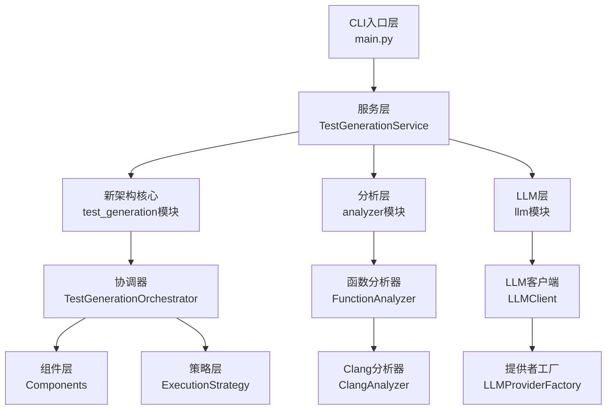

我将系统地分析您的代码库，梳理代码脉络并识别存在的问题。让我先从项目的整体架构和核心组件开始。

```toolCall::search_memory
```

现在让我读取核心文件来了解具体的代码实现：

```toolCall::read_file
```


```toolCall::read_file
```


```toolCall::read_file
```

现在让我继续分析核心组件：

```toolCall::read_file
```


```toolCall::read_file
```


```toolCall::read_file
```

让我继续分析配置管理和LLM客户端：

```toolCall::read_file
```


```toolCall::read_file
```


```toolCall::read_file
```

现在让我查看测试文件来了解项目的测试现状：

```toolCall::list_dir
```


```toolCall::read_file
```


```toolCall::read_file
```

最后，让我检查一下配置文件和脚本：

```toolCall::read_file
```


```toolCall::list_dir
```


```toolCall::get_problems
```

现在让我分析项目的整体情况，生成完整的代码脉络和问题报告：

## AI-DT 项目代码脉络和问题分析报告

### 📋 项目概览

**AI-DT（AI-Driven Test Generator）** 是一个基于大语言模型的C/C++单元测试自动生成工具。项目采用分层模块化架构，通过静态代码分析、智能上下文理解和多LLM集成，实现高质量测试用例的自动化生成。

### 🏗️ 代码架构脉络

#### 1. **核心架构层次**


#### 2. **模块组织结构**

**核心模块分布：**
- **入口层**：`src/main.py` - 统一CLI接口
- **服务层**：
  - `src/services/test_generation_service.py` - 旧版服务入口（向后兼容）
  - `src/test_generation/service.py` - 新版服务核心
- **协调层**：`src/test_generation/orchestrator.py` - 流程协调器
- **组件层**：`src/test_generation/components.py` - 可插拔功能组件
- **分析层**：`src/analyzer/` - 代码静态分析
- **LLM层**：`src/llm/` - 大模型集成
- **工具层**：`src/utils/` - 通用工具函数

#### 3. **关键设计模式**

1. **工厂模式**：[ComponentFactory](file://c:\Users\chenmin\ai-dt\src\test_generation\components.py#L234-L262)、[LLMProviderFactory](file://c:\Users\chenmin\ai-dt\src\llm\factory.py#L14-L116)、[ExecutionStrategyFactory](file://c:\Users\chenmin\ai-dt\src\test_generation\strategies.py#L208-L234)
2. **策略模式**：[ExecutionStrategy](file://c:\Users\chenmin\ai-dt\src\test_generation\strategies.py#L16-L29)（并发/顺序执行）
3. **装饰器模式**：LLM装饰器链（重试、日志、错误处理）
4. **依赖注入**：各组件支持外部依赖注入
5. **模板方法**：测试生成流程标准化

### 🔍 代码质量现状

#### ✅ **架构优势**

1. **清晰的分层设计**
   - 职责分离良好
   - 模块化程度高
   - 向后兼容性保持

2. **灵活的配置管理**
   - YAML配置文件完整
   - 多项目支持
   - 多LLM提供者集成

3. **完善的错误处理**
   - 统一错误处理装饰器
   - 重试机制实现
   - 详细日志记录

4. **可扩展性设计**
   - 组件化架构
   - 工厂模式支持新增组件
   - 策略模式支持不同执行方式

#### ⚠️ **存在的问题**

### 🚨 **重要问题识别**

#### 1. **架构重复和混乱**
- **问题**：同时存在新旧两套架构，代码重复严重
- **影响**：维护困难，新功能开发混乱
- **位置**：
  - `src/services/test_generation_service.py`（旧版）
  - `src/test_generation/service.py`（新版）
  - `src/generator/`（遗留模块）

#### 2. **依赖管理问题**
- **问题**：新旧架构交叉依赖，循环导入风险
- **影响**：代码耦合度高，测试困难
- **示例**：新版服务依赖旧版服务的某些组件

#### 3. **测试覆盖不足**
- **问题**：
  - 新架构组件缺少单元测试
  - 集成测试不完整
  - 测试数据模拟不充分
- **影响**：重构风险高，功能回归难以发现

#### 4. **配置管理混乱**
- **问题**：
  - 配置散布在多个地方
  - 新旧架构配置格式不统一
  - 缺少配置验证机制

#### 5. **文档和注释不一致**
- **问题**：
  - 代码注释与实际实现不匹配
  - 缺少架构决策文档
  - API文档不完整

### 📊 **代码质量指标**

| 维度 | 状态 | 评分 | 说明 |
|------|------|------|------|
| 架构设计 | 🟡 混乱 | 6/10 | 新旧架构并存，需要重构 |
| 代码重复 | 🔴 严重 | 4/10 | 大量重复代码，维护困难 |
| 测试覆盖 | 🟡 不足 | 5/10 | 部分模块有测试，但覆盖不全 |
| 文档质量 | 🟡 一般 | 6/10 | 有基本文档，但不够详细 |
| 可维护性 | 🔴 差 | 4/10 | 依赖混乱，修改影响面大 |
| 扩展性 | 🟢 良好 | 8/10 | 设计模式使用得当 |

### 🎯 **建议决策路径**

基于以上分析，我强烈建议您**优先进行重构和测试防护**，原因如下：

#### **为什么先重构？**

1. **技术债务积累严重**
   - 新旧架构并存导致维护成本指数级增长
   - 每次新功能开发都需要在两套架构中同步

2. **测试防护缺失**
   - 当前测试覆盖率不足，新功能开发风险高
   - 缺少回归测试保护，容易引入新BUG

3. **开发效率低下**
   - 开发者需要理解两套架构
   - 代码重复导致修改多处同步

#### **重构优先级建议**

🔥 **第一阶段：架构统一（2-3周）**
1. 完全迁移到新架构
2. 移除旧版服务代码
3. 统一配置管理

🛡️ **第二阶段：测试防护（1-2周）**
1. 补充核心组件单元测试
2. 添加集成测试
3. 建立CI/CD测试流水线

📝 **第三阶段：文档完善（1周）**
1. 更新API文档
2. 补充架构设计文档
3. 编写开发者指南

### 💡 **重构后的收益**

1. **开发效率提升**：单一架构，开发路径清晰
2. **维护成本降低**：减少代码重复，简化依赖关系
3. **质量保障**：完善的测试覆盖，降低回归风险
4. **团队协作**：清晰的文档，降低新人上手成本

### 🚀 **后续新功能开发**

重构完成后，您可以安全地开发新功能，如：
- 支持更多编程语言
- 增强测试用例生成质量
- 添加性能分析功能
- 集成更多LLM提供者

**结论**：当前代码状态不适合直接开发新功能，建议优先完成重构和测试防护，为后续稳定开发奠定基础。